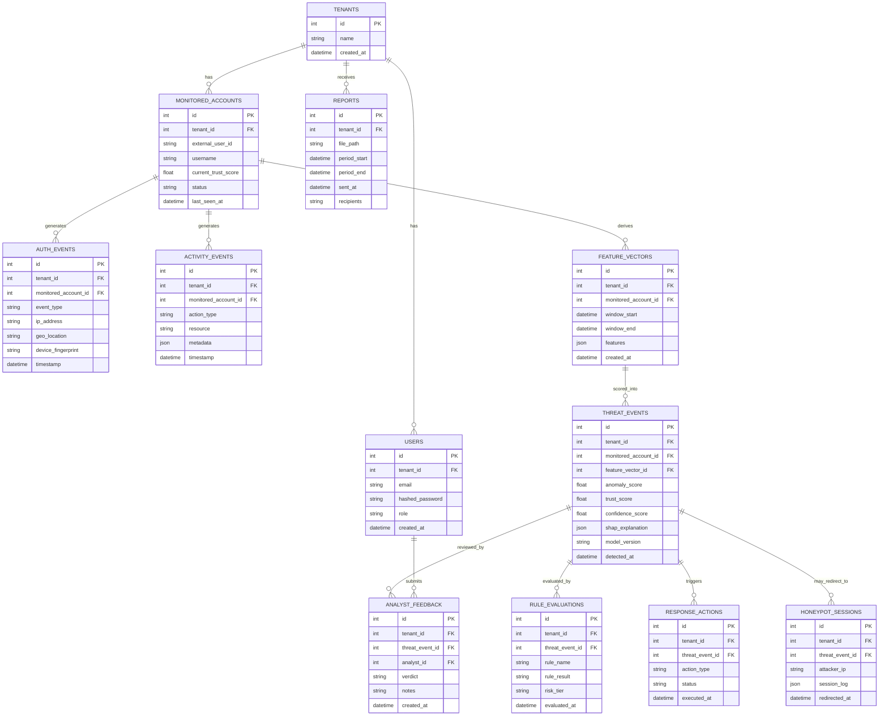
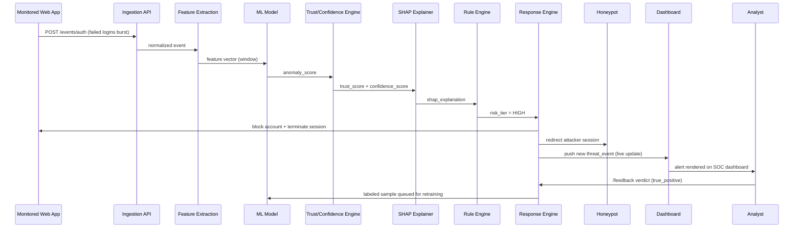

# SOC CoPilot — System Architecture & Development Roadmap
**Adaptive Security Operations Platform for Intelligent Threat Detection and Automated Response**
*Prepared as a senior-architect design review — B.Tech Final Year Project*

---

## 1. Executive Summary

SOC CoPilot ingests authentication and user-activity events, extracts behavioral features, scores each event with an unsupervised ML model (Isolation Forest, with One-Class SVM as a comparison model), converts that score into a **Trust Score** and **Threat Confidence Score**, explains the decision with SHAP, applies policy rules to pick a response tier (monitor / challenge / block), executes that response (including honeypot redirection for high-risk actors), surfaces everything on a live SOC dashboard, and closes the loop with analyst feedback that feeds continuous model improvement.

Stack: **React + Tailwind + Recharts + Axios** (frontend) · **FastAPI + SQLAlchemy** (backend) · **PostgreSQL** (database) · **Scikit-learn + SHAP** (ML/XAI) · **JWT + bcrypt** (auth) · **ReportLab + SMTP** (reporting) · **Docker → Vercel/Render** (deployment).

---

## 2. System Architecture

### 2.1 Layered Pipeline

```
                    ┌─────────────────────────┐
                    │   Data Sources           │
                    │ (login logs, activity)   │
                    └───────────┬─────────────┘
                                ↓
                    ┌─────────────────────────┐
                    │  Event Ingestion API     │  ← single normalized
                    │  (FastAPI + Pydantic)    │    event schema
                    └───────────┬─────────────┘
                     ┌──────────┴──────────┐
                     ↓                     ↓
         ┌───────────────────┐  ┌───────────────────────┐
         │ Auth Monitoring    │  │ User Activity Monitor  │
         └──────────┬─────────┘  └───────────┬───────────┘
                     └───────────┬────────────┘
                                 ↓
                    ┌─────────────────────────┐
                    │   Feature Extraction     │
                    └───────────┬─────────────┘
                                ↓
                    ┌─────────────────────────┐
                    │  ML Threat Detection      │
                    │  (Isolation Forest /      │
                    │   One-Class SVM)          │
                    └───────────┬─────────────┘
                                ↓
              ┌─────────────────┴──────────────────┐
              ↓                                     ↓
   ┌─────────────────────┐               ┌─────────────────────────┐
   │  Trust Score Engine   │               │  Threat Confidence Engine│
   └──────────┬───────────┘               └────────────┬────────────┘
              └──────────────────┬────────────────────┘
                                  ↓
                    ┌─────────────────────────┐
                    │   Explainable AI (SHAP)   │
                    └───────────┬─────────────┘
                                ↓
                    ┌─────────────────────────┐
                    │      Rule Engine          │
                    └───────────┬─────────────┘
                                ↓
                    ┌─────────────────────────┐
                    │  Adaptive Response Engine │──────┐
                    └───────────┬─────────────┘        ↓
                                ↓                ┌─────────────┐
                    ┌─────────────────────────┐  │  Honeypot    │
                    │   SOC Dashboard (React)   │  └─────────────┘
                    └───────────┬─────────────┘
                                ↓
              ┌─────────────────┴──────────────────┐
              ↓                                     ↓
   ┌─────────────────────┐               ┌─────────────────────────┐
   │  Reports (ReportLab   │               │  Analyst Feedback Loop   │
   │   + SMTP)             │               │                          │
   └───────────────────────┘               └────────────┬────────────┘
                                                          ↓
                                            ┌─────────────────────────┐
                                            │ Continuous Improvement   │
                                            │  (model retraining)      │
                                            └─────────────────────────┘

Cross-cutting concerns (apply to every layer):
  • Multi-Tenant Support — tenant_id scoping on every table/query
  • JWT + bcrypt authentication on all API routes
  • Dockerized services, deployed via Render (API/DB) + Vercel (frontend)
```

### 2.2 Architectural Decisions & Rationale

| Decision | Why | Trade-off |
|---|---|---|
| Insert an **Event Ingestion API** layer instead of feeding auth/activity monitors directly | One normalized schema simplifies Feature Extraction and keeps the system open to future SIEM/Kafka integration (NFR8) | One extra hop per event; negligible at project scale |
| **Isolation Forest** as primary model, **One-Class SVM** as comparison | No labeled attack data exists → must use unsupervised anomaly detection; having two models gives a genuine model-evaluation section for your report | Slightly more training/serving code to maintain |
| **JSONB columns** for `features`, `metadata`, `shap_explanation` | Feature engineering will evolve fast during development; JSONB avoids migrations every time a feature is added/removed | Less DB-level type safety — enforced instead at the Pydantic schema boundary |
| **`tenant_id` baked in from day one** (not retrofitted later) | Retrofitting isolation into a system that already has queries, dashboards, and joins built is a rewrite, not an add-on | Marginal extra filter clause on every query, paid once, upfront |
| **Layered/modular monolith**, not microservices | 15 modules as microservices would add deployment/orchestration complexity disproportionate to a single-team B.Tech project | Less "cloud-native" story for viva, but far more shippable in the timeline |

---

## 3. Module Breakdown

| # | Module | Responsibility | Key Tech |
|---|---|---|---|
| 1 | Authentication Monitoring | Capture login/logout/failed-login/password-reset events | FastAPI, SQLAlchemy |
| 2 | User Activity Monitoring | Capture in-app actions (downloads, privilege changes, exports) | FastAPI, SQLAlchemy |
| 3 | Feature Extraction | Convert raw events into windowed numeric feature vectors | Pandas, NumPy |
| 4 | ML Threat Detection | Score feature vectors for anomaly | Scikit-learn (Isolation Forest, One-Class SVM) |
| 5 | Trust Score Engine | Maintain a rolling 0–100 trust score per monitored account | Custom scoring logic |
| 6 | Threat Confidence Engine | Convert anomaly score → 0–100% confidence for the current event | Custom scoring logic |
| 7 | Explainable AI | Explain *why* a score was assigned, per feature contribution | SHAP |
| 8 | Rule Engine | Map (trust, confidence) → risk tier (HIGH/MEDIUM/LOW) via configurable policy | Python rules module |
| 9 | Adaptive Response | Execute the action tied to the risk tier (block, 2FA, monitor) | FastAPI services |
| 10 | Honeypot | Redirect high-risk sessions to a decoy environment, log attacker behavior | FastAPI isolated route/session |
| 11 | SOC Dashboard | Real-time alerts, scores, timeline, KPIs | React, Recharts, Axios |
| 12 | Reports | Periodic PDF summaries emailed to analysts | ReportLab, SMTP |
| 13 | Analyst Feedback | Analyst confirms/reverts actions, labels true/false positives | FastAPI, React |
| 14 | Continuous Improvement | Use analyst-labeled data to retrain/recalibrate the model | Scikit-learn, scheduled job |
| 15 | Multi-Tenant Support | Isolate data and dashboards per organization | `tenant_id` scoping, JWT claims |

---

## 4. Folder Structure

**Backend**
```
backend/
├── app/
│   ├── main.py
│   ├── core/              # config, security (JWT/bcrypt), settings
│   ├── db/                 # SQLAlchemy engine, session, base
│   ├── models/              # ORM models (one file per entity)
│   ├── schemas/              # Pydantic request/response schemas
│   ├── api/v1/                # routers: auth, events, dashboard, reports, feedback
│   ├── services/              # trust_engine, confidence_engine, rule_engine,
│   │                            response_engine, honeypot, notifier
│   ├── ml/                    # feature_extraction.py, model.py, shap_explainer.py, train.py
│   └── tasks/                  # scheduled jobs (reports, retraining)
├── alembic/                    # DB migrations
├── tests/
├── requirements.txt
└── Dockerfile
```

**Frontend**
```
frontend/
├── src/
│   ├── components/    # AlertCard, ScoreGauge, ThreatTimeline, etc.
│   ├── pages/           # Dashboard, Login, Reports, Feedback, Settings
│   ├── features/         # state slices per domain
│   ├── services/          # axios API clients
│   ├── hooks/
│   └── utils/
├── package.json
└── Dockerfile
```

---

## 5. Database ER Diagram



*Design note:* `features`, `metadata`, and `shap_explanation` are JSONB rather than rigid columns — a deliberate scalability trade-off explained in §2.2.

---

## 6. API Flow

### 6.1 Core REST Endpoints

| Method | Endpoint | Purpose |
|---|---|---|
| POST | `/api/v1/auth/login` | Analyst login → JWT |
| POST | `/api/v1/auth/register` | Create analyst account (admin only) |
| POST | `/api/v1/events/auth` | Ingest an authentication event |
| POST | `/api/v1/events/activity` | Ingest a user-activity event |
| GET | `/api/v1/threats` | List threat events (filterable by tier, date, account) |
| GET | `/api/v1/threats/{id}` | Threat detail incl. SHAP explanation |
| POST | `/api/v1/threats/{id}/feedback` | Analyst submits verdict (true/false positive) |
| GET | `/api/v1/dashboard/summary` | KPIs: threats detected, users blocked, honeypots active, avg trust |
| GET | `/api/v1/dashboard/timeline` | Recent incident timeline |
| POST | `/api/v1/response/{threat_id}/override` | Analyst manually reverts/escalates a response |
| GET | `/api/v1/reports` | List generated reports |
| POST | `/api/v1/reports/generate` | Trigger an on-demand report |

### 6.2 End-to-End Detection Flow (Sequence)



---

## 7. Development Roadmap

| Phase | Milestone | Modules | Est. Duration |
|---|---|---|---|
| 0 | Scaffolding: Docker Compose (FastAPI + Postgres + React), JWT/bcrypt auth, core DB schema incl. `tenant_id` | Foundation, Module 15 | 1 week |
| 1 | Event Ingestion + Auth Monitoring + User Activity Monitoring | 1, 2 | 1 week |
| 2 | Feature Extraction pipeline | 3 | 1 week |
| 3 | ML Threat Detection — train/serve Isolation Forest + One-Class SVM comparison | 4 | 1.5 weeks |
| 4 | Trust Score Engine + Threat Confidence Engine | 5, 6 | 1 week |
| 5 | Explainable AI (SHAP) integration | 7 | 1 week |
| 6 | Rule Engine + Adaptive Response (HIGH/MEDIUM/LOW tiers) | 8, 9 | 1 week |
| 7 | Honeypot module | 10 | 1 week |
| 8 | SOC Dashboard (React + Recharts, live updates) | 11 | 1.5 weeks |
| 9 | Reports (ReportLab) + SMTP notifications | 12 | 1 week |
| 10 | Analyst Feedback loop + Continuous Improvement (retrain trigger) | 13, 14 | 1 week |
| 11 | Multi-tenancy validation across all modules (already scaffolded in Phase 0) | 15 | 0.5 week |
| 12 | Hardening, Postman test suite, Docker deployment (Render + Vercel), documentation/PPT/diagrams/viva prep | — | 1.5 weeks |

**Total: ~13–14 weeks**, sequenced so each phase produces a demoable increment (useful for periodic guide reviews).

---

## 8. Next Steps

Recommended order of execution:
1. Approve/adjust the DB schema (§5).
2. Scaffold Phase 0 (Docker Compose, auth skeleton, migrations).
3. Build Phases 1–3 to get a working detection pipeline before layering scoring/XAI/response on top.

This document is meant to be a living reference — as the project evolves, this ER diagram and roadmap should be the source of truth for what deviates from the original synopsis.
